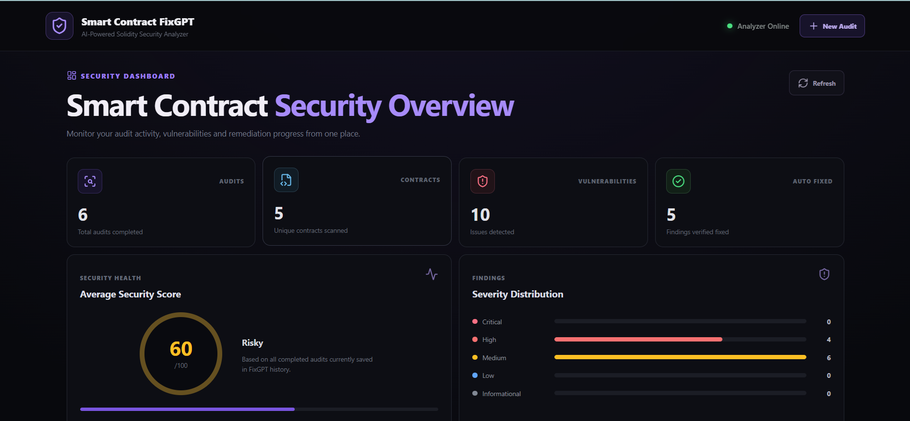
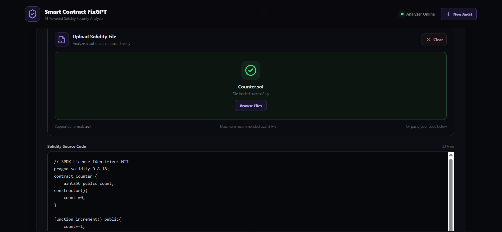
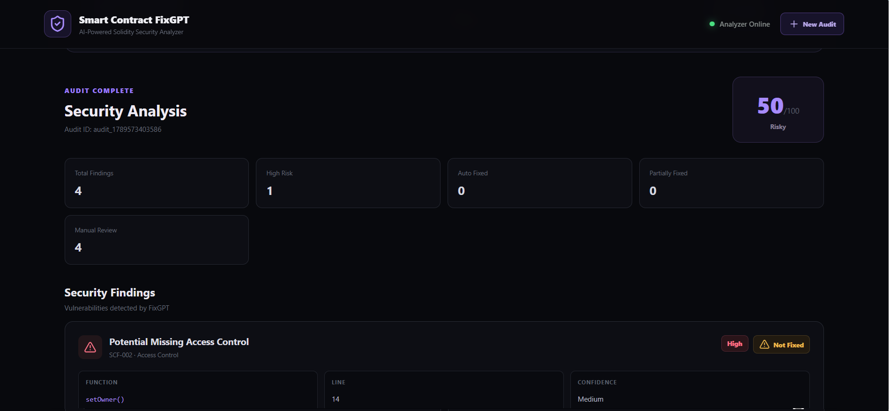
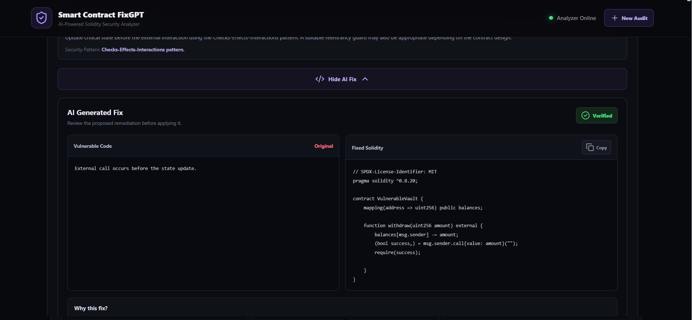
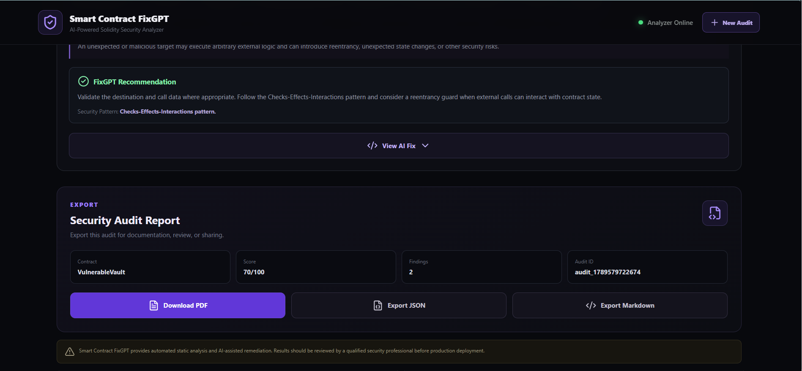
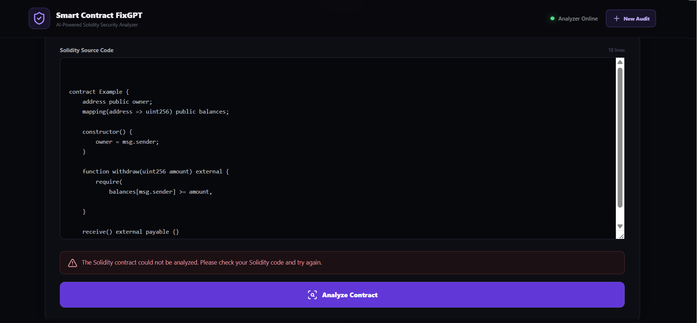

# 🚀 Smart Contract FixGPT AI Tool

<div align="center">


</div>

---

# 📖 Project Overview

The **Smart Contract FixGPT AI Tool** is an AI-powered smart contract security analysis platform developed as part of the **EtherAuthority Web3 Internship**.

The platform helps developers identify common Solidity smart contract security issues, understand their security impact, receive remediation suggestions, generate corrected Solidity code for supported vulnerabilities, and verify proposed fixes through compilation and re-analysis.

The core workflow is:

**Detect → Explain → Fix → Re-Analyze → Report**

The project combines Solidity parsing, custom security detectors, a backend REST API, automated remediation logic, fixed-code compilation, verification, and a React-based frontend.

---

# 🎯 Objectives

- 🔍 Analyze Solidity smart contracts for security vulnerabilities.
- 🧠 Explain detected vulnerabilities in understandable language.
- 🛠️ Generate remediation suggestions and fixed Solidity code where supported.
- 🔄 Re-analyze proposed fixes.
- ✅ Compile fixed Solidity code to verify syntax and compiler compatibility.
- 📊 Calculate a security score from detected findings.
- 🧪 Test vulnerability detectors and remediation workflows.
- 💻 Provide a simple web interface for contract analysis.
- 📄 Prepare security findings for reporting and review.
- 🎓 Build a practical smart contract security project for the EtherAuthority internship.

---

# ✨ Features

- 🔍 Solidity source-code analysis
- 📁 Solidity file upload support
- 🧩 Solidity AST-based parsing
- 🛡️ 20 custom security detectors
- 🚨 Severity classification
- 🎯 Confidence classification
- 📊 Security score from 0–100
- 🧠 AI-style vulnerability explanations
- 🛠️ Automated fixes for selected vulnerabilities
- 🔄 Fixed-code re-analysis
- ✅ Fixed-code compiler verification
- 📋 Remaining-finding detection
- ⚠️ Verification failure reporting
- ⏳ Loading state during analysis
- ❌ Invalid Solidity error handling
- 📱 React-based security dashboard
- 🧾 Audit history
- 💻 Backend REST API

---

# 🛡️ Security Detectors

The analyzer currently contains 20 security detectors.

| ID | Detector | Category |
|----|----------|----------|
| SCF-001 | Reentrancy | Reentrancy |
| SCF-002 | Missing Access Control | Access Control |
| SCF-003 | Unchecked Arithmetic | Arithmetic |
| SCF-004 | Low-Level External Call | External Calls |
| SCF-005 | Denial of Service | DoS |
| SCF-006 | Weak Randomness | Randomness |
| SCF-007 | Unchecked Return Value | External Calls |
| SCF-008 | tx.origin Usage | Authentication |
| SCF-009 | selfdestruct Usage | Contract Security |
| SCF-010 | Unprotected Initializer | Upgradeability |
| SCF-011 | delegatecall | Upgradeability |
| SCF-012 | Zero Address Validation | Input Validation |
| SCF-013 | Token Approval | Token Security |
| SCF-014 | Oracle Manipulation | DeFi / Oracle |
| SCF-015 | Flash Loan Risk | DeFi |
| SCF-016 | Signature Replay | Authentication |
| SCF-017 | Signature Malleability | Cryptography |
| SCF-018 | Upgrade Authorization | Upgradeability |
| SCF-019 | Storage Collision | Upgradeability |
| SCF-020 | Unsafe ETH Transfer | ETH Transfer |

> The detectors are heuristic/static-analysis rules and should not be treated as a complete formal security audit.

---

# 🏗️ Project Architecture

```text
                         User
                           │
                           ▼
                 ┌───────────────────┐
                 │   React Frontend  │
                 │      + Vite       │
                 └─────────┬─────────┘
                           │
                           ▼
                 ┌───────────────────┐
                 │   REST API        │
                 │ Node + Express    │
                 │   + TypeScript    │
                 └─────────┬─────────┘
                           │
                           ▼
                 ┌───────────────────┐
                 │ Solidity Analyzer │
                 │ Parser + AST      │
                 │ 20 Detectors      │
                 └─────────┬─────────┘
                           │
                           ▼
                 ┌───────────────────┐
                 │    FixGPT Engine  │
                 │ Explain + Fix     │
                 └─────────┬─────────┘
                           │
                           ▼
                 ┌───────────────────┐
                 │ Fix Verification  │
                 │ Compile + Analyze │
                 └─────────┬─────────┘
                           │
                           ▼
                 ┌───────────────────┐
                 │ Results / Report  │
                 └───────────────────┘
```

---

# ⚙️ Core Workflow

```text
User submits Solidity contract
            │
            ▼
      Solidity Parsing
            │
            ▼
       AST Analysis
            │
            ▼
     Security Detectors
            │
            ▼
   Findings + Severity
            │
            ▼
   Explain Vulnerability
            │
            ▼
      Generate Fix
            │
            ▼
    Compile Fixed Code
            │
            ▼
       Re-Analyze
            │
            ▼
       Verification
            │
            ▼
      Final Results
```

---

# 🔍 Smart Contract Analysis

The analyzer parses Solidity source code and extracts structural information such as:

- Contract names
- Functions
- Modifiers
- State variables
- Events
- Constructors
- Inheritance
- Interfaces
- Libraries
- External calls
- ETH transfers
- Token interactions
- Security-sensitive operations

The analyzer then runs custom security detectors against the parsed contract.

---

# 🚨 Findings

Each security finding contains structured information.

```text
Finding
│
├── ID
├── Title
├── Severity
├── Confidence
├── Category
├── Contract Name
├── Function Name
├── Line Number
├── Description
├── Impact
├── Recommendation
├── Vulnerable Code
└── AI Analysis
    ├── Summary
    ├── Explanation
    ├── Fix
    ├── Fixed Code
    ├── Security Pattern
    └── Side Effects
```

---

# 📊 Severity Levels

| Severity | Meaning |
|----------|---------|
| Critical | Very serious security issue requiring immediate review |
| High | Significant vulnerability with potentially serious impact |
| Medium | Security issue requiring remediation or review |
| Low | Lower-impact security concern |
| Informational | Security-related observation |

---

# 🎯 Confidence Levels

Findings also contain a confidence level:

- **High**
- **Medium**
- **Low**

Confidence represents how strongly the static-analysis rule matches the detected pattern.

---

# 📈 Security Score

Smart Contract FixGPT calculates a security score between **0 and 100**.

The frontend presents the score using:

```text
80–100  → Good
40–79   → Risky
0–39    → Critical
```

The score is intended as a development aid and **does not guarantee that a smart contract is secure**.

---

# 🧠 FixGPT Remediation

For supported vulnerabilities, FixGPT can generate a remediation and corrected Solidity code.

The remediation process includes:

```text
Vulnerability
      │
      ▼
Security Explanation
      │
      ▼
Recommended Pattern
      │
      ▼
Generated Fixed Code
      │
      ▼
Compiler Verification
      │
      ▼
Static Re-Analysis
      │
      ▼
Verification Status
```

Supported automated remediation includes selected patterns such as:

- Reentrancy / Checks-Effects-Interactions
- External-call ordering
- Unchecked arithmetic
- Denial-of-service loop bounding
- tx.origin replacement

Other vulnerabilities are returned for manual security review where automatically modifying the contract could change business logic or produce unsafe assumptions.

---

# ✅ Fix Verification

Generated fixes are treated as proposed remediations rather than automatically trusted solutions.

The platform verifies fixes using:

- Solidity compilation
- Compiler error collection
- Compiler warning collection
- Static security re-analysis
- Remaining-finding comparison

### Verification Status

| Status | Description |
|--------|-------------|
| Fixed | Proposed fix compiled and the targeted finding was mitigated |
| Partially Fixed | Some security concerns remain |
| Not Fixed | The targeted issue remains |
| Verification Failed | Fixed code could not be successfully verified |

---

# 💻 Frontend Integration

The frontend is built using **React** and **Vite**.

### Functionalities

- Enter Solidity source code
- Upload Solidity files
- Start security analysis
- Display loading state
- Display validation errors
- Display security score
- Display vulnerability findings
- Display severity and confidence
- Display remediation details
- Display fixed Solidity code
- Display verification results
- Store audit history

---

# ⚙️ Backend Integration

The backend is developed using **Node.js, Express, and TypeScript**.

### Backend Responsibilities

- Request validation
- Solidity analysis
- Security finding generation
- Fix generation
- Fixed-code compilation
- Re-analysis
- Verification
- Security score calculation
- REST API responses

---

# 🔌 API

## Health Check

```http
GET /api/health
```

Example response:

```json
{
  "status": "ok",
  "service": "Smart Contract FixGPT API",
  "version": "0.1.0"
}
```

---

## Audit Contract

```http
POST /api/audit
```

Example request:

```json
{
  "contractName": "VulnerableVault",
  "solidityVersion": "0.8.20",
  "sourceCode": "pragma solidity ^0.8.20; ..."
}
```

Example response structure:

```json
{
  "auditId": "audit_123456789",
  "status": "completed",
  "score": 70,
  "findings": []
}
```

For invalid Solidity or failed analysis, the API returns a failed status so the frontend can display an appropriate error instead of a misleading security result.

---

# 🧪 Testing

The analyzer includes tests for security detectors and sample vulnerable and secure contracts.

### Tested Security Categories

- Reentrancy
- Access control
- Arithmetic
- External calls
- Denial of service
- Weak randomness
- Unchecked return values
- tx.origin
- selfdestruct
- Upgradeability
- delegatecall
- Zero-address validation
- Token approvals
- Oracle patterns
- Flash-loan patterns
- Signature security
- Storage collision
- ETH transfers

### Example Reentrancy Test

Vulnerable pattern:

```solidity
function withdraw(uint256 amount) external {
    (bool success,) = msg.sender.call{value: amount}("");
    require(success);

    balances[msg.sender] -= amount;
}
```

Proposed remediation:

```solidity
function withdraw(uint256 amount) external {
    balances[msg.sender] -= amount;

    (bool success,) = msg.sender.call{value: amount}("");
    require(success);
}
```

The fixed code is compiled and re-analyzed before the remediation is reported as verified.

---

# 🧪 Production Build Validation

The project was validated using:

### Backend TypeScript

```bash
cd backend
npx tsc --noEmit
```

### Frontend Production Build

```bash
cd frontend
npm run build
```

The final validation also included:

- Valid Solidity analysis
- Secure contract analysis
- Vulnerable contract analysis
- Invalid Solidity error handling
- Automated-fix verification
- Frontend end-to-end analysis flow
- Git working-tree verification

---

# 📦 Installation

## 1. Clone Repository

```bash
git clone https://github.com/anuragreddy23-dot/Smart-Contract-FixGPT-AI-Tool.git
```

```bash
cd Smart-Contract-FixGPT-AI-Tool
```

## 2. Install Analyzer Dependencies

```bash
cd analyzer
npm install
```

## 3. Install Backend Dependencies

```bash
cd ../backend
npm install
```

## 4. Install Frontend Dependencies

```bash
cd ../frontend
npm install
```

---

# ▶️ Running the Project

## Start Backend

```bash
cd backend
npm run dev
```

Backend:

```text
http://127.0.0.1:5000
```

Health check:

```text
http://127.0.0.1:5000/api/health
```

---

## Start Frontend

Open another terminal:

```bash
cd frontend
npm run dev
```

Frontend:

```text
http://localhost:5173
```

---

# 🏗️ Project Structure

```text
Smart-Contract-FixGPT-AI-Tool/
│
├── analyzer/
│   ├── detectors/
│   │   ├── reentrancyDetector.js
│   │   ├── accessControlDetector.js
│   │   ├── arithmeticDetector.js
│   │   ├── externalCallDetector.js
│   │   ├── dosDetector.js
│   │   ├── randomnessDetector.js
│   │   ├── uncheckedReturnValueDetector.js
│   │   ├── txOriginDetector.js
│   │   ├── selfdestructDetector.js
│   │   ├── upgradeabilityDetector.js
│   │   ├── delegatecallDetector.js
│   │   ├── zeroAddressDetector.js
│   │   ├── tokenApprovalDetector.js
│   │   ├── oracleManipulationDetector.js
│   │   ├── flashLoanDetector.js
│   │   ├── signatureReplayDetector.js
│   │   ├── signatureMalleabilityDetector.js
│   │   ├── upgradeAuthorizationDetector.js
│   │   ├── storageCollisionDetector.js
│   │   └── unsafeEthTransferDetector.js
│   │
│   ├── parsers/
│   │   ├── solidityParser.js
│   │   └── contractStructure.js
│   │
│   ├── tests/
│   ├── analyzer.js
│   ├── index.js
│   ├── utils.js
│   └── package.json
│
├── backend/
│   └── src/
│       ├── ai/
│       │   ├── ai.service.ts
│       │   └── fix.generator.ts
│       │
│       ├── routes/
│       │   └── audit.routes.ts
│       │
│       ├── services/
│       │   ├── audit.service.ts
│       │   └── solidity.compiler.ts
│       │
│       ├── types/
│       │   ├── audit.ts
│       │   └── fixgpt-analyzer.d.ts
│       │
│       └── server.ts
│
├── frontend/
│   └── src/
│       ├── App.tsx
│       ├── App.css
│       ├── index.css
│       └── main.tsx
│
├── README.md
└── .gitignore
```

---

# 📷 Project Screenshots

Create a folder:

```text
docs/screenshots/
```

Recommended screenshots:

```text
docs/screenshots/
├── home.png
├── contract-input.png
├── analysis-results.png
├── finding-details.png
├── ai-fix.png
├── verification-fixed.png
└── invalid-contract.png
```

### 🏠 Home Page

```md

```

### 🔍 Contract Analysis

```md

```

### 🚨 Security Findings

```md

```

### 🧠 AI Fix

```md

```

### ✅ Fix Verification

```md

```

### ❌ Invalid Solidity Handling

```md

```
## 🚀 Live Deployment

### Frontend
🌐 **Live Application:**  
https://smart-contract-fix-gpt-ai-tool.vercel.app/

### Backend
⚙️ **Backend API:**  
https://smart-contract-fixgpt-ai-tool.onrender.com/

### Backend Health Check
🩺 **API Health:**  
https://smart-contract-fixgpt-ai-tool.onrender.com/api/health

> The frontend is deployed on Vercel and the backend API is deployed on Render.

---

# 🎥 Demo Video

Record a short demonstration covering:

- Opening Smart Contract FixGPT
- Entering Solidity source code
- Running security analysis
- Viewing detected vulnerabilities
- Opening a remediation
- Showing fixed Solidity code
- Showing verification status
- Demonstrating invalid Solidity error handling

### Demo Video Link

```text

```
https://drive.google.com/file/d/1IR1IJtU9ex0eqr90rvVDLxBGAV7PuIEI/view?usp=sharing
---

# 📋 Internship Requirements Completed

| Requirement | Status |
|------------|--------|
| Smart Contract Security Analysis | ✅ Completed |
| Solidity Parsing / AST Analysis | ✅ Completed |
| Vulnerability Detection | ✅ Completed |
| Security Severity Classification | ✅ Completed |
| AI Fix / Remediation Workflow | ✅ Completed |
| Fixed-Code Verification | ✅ Completed |
| Re-Analysis Workflow | ✅ Completed |
| Security Scoring | ✅ Completed |
| Frontend Integration | ✅ Completed |
| Backend REST API | ✅ Completed |
| Error Handling | ✅ Completed |
| Loading UI | ✅ Completed |
| Testing | ✅ Completed |
| Documentation | ✅ Completed |
| GitHub Publication | ✅ Completed |
| Internship Project | ✅ Completed |
| Demo Video | ⏳ Add Link |

---

# 🔮 Future Improvements

- 🤖 More advanced LLM-based code reasoning
- 🧪 Slither integration
- 🔎 Solhint integration
- 🧩 Larger AST-based vulnerability rule set
- 📦 ZIP project upload
- 🔗 GitHub repository scanning
- 🌐 Deployed contract/address analysis
- 📄 PDF security reports
- 📝 Markdown/JSON report export
- 🗂️ Persistent audit history
- 👥 User authentication
- ☁️ Cloud deployment
- 📊 Security trend dashboards
- 🔄 Improved automated remediation
- 🧠 Cross-contract analysis
- 🧪 Property-based and fuzz testing
- 🔐 More upgradeability and DeFi-specific checks

---

# ⚠️ Security Disclaimer

Smart Contract FixGPT is a **security analysis and development-assistance tool**.

Static analysis and automated remediation cannot guarantee that a smart contract is secure.

Generated fixes may change business logic or introduce assumptions that require additional review.

Contracts handling real assets should receive a professional manual security audit and appropriate testing before deployment.

---

# 👨‍💻 Author

**Mothe Anurag Reddy**

B.Tech Computer Science & Engineering

Sreenidhi Institute of Science and Technology

EtherAuthority Web3 Internship

GitHub: https://github.com/anuragreddy23-dot

LinkedIn: https://www.linkedin.com/in/anuragreddy-mothe-21a699329

---

# 🙏 Acknowledgements

Special thanks to:

- EtherAuthority
- Solidity
- React
- Vite
- Node.js
- Express
- OpenZeppelin
- Solidity Parser ecosystem
- Web3 and smart contract security community

for providing the tools, frameworks, and learning resources used during the development of this project.

---

# 📄 License

This project was developed as part of the **EtherAuthority Web3 Internship Program** for educational and learning purposes.

Licensed under the **MIT License**.
